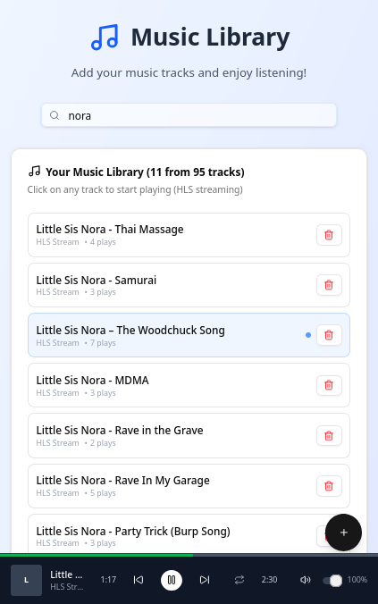

# 🎵 Music Library

A modern HLS music streaming application with URL-based audio downloading. Paste any YouTube, SoundCloud, or supported URL and stream your music library via HLS.

<p align="center">
  
   
</p>

## ✨ Features

- **🔗 URL Downloads** - Paste URLs from YouTube, SoundCloud, Bandcamp, and 1000+ sites
- **📡 HLS Streaming** - Audio is converted to HLS format for efficient streaming
- **🎵 Music Player** - Full-featured player with play/pause, seek, volume, next/previous
- **🔀 Shuffle Mode** - Randomize track playback order
- **🔁 Repeat Modes** - Repeat all, repeat one, or no repeat
- **😴 Sleep Timer** - Auto-stop after 15m/30m/1h/2h with smooth volume fade-out
- **⌨️ Keyboard Shortcuts** - Space, arrows, M, S, R, T for quick controls
- **📱 Responsive UI** - Beautiful React frontend with modern design
- **🔒 Readonly Mode** - Optional mode to disable adding/removing tracks
- **💾 Persistent Storage** - Downloaded tracks are stored on server

## 🏗️ Architecture

```
┌─────────────────┐         ┌─────────────────┐
│  React Frontend │ ◄─────► │   Rust Server   │
│   (Vite)        │  HTTP   │    (Warp)       │
│   Port 5173     │         │   Port 8080     │
└─────────────────┘         └─────────────────┘
                                    │
                            ┌───────┴───────┐
                            │   HLS Cache   │
                            │  (hls_cache/) │
                            └───────────────┘
```

## Prerequisites

- [Bun](https://bun.sh/) - JavaScript runtime
- [Rust](https://rustup.rs/) - For the backend server
- [FFmpeg](https://ffmpeg.org/) - For HLS conversion
- [yt-dlp](https://github.com/yt-dlp/yt-dlp) - For URL downloads

### Install Dependencies

```bash
# Ubuntu/Debian
sudo apt install ffmpeg
pip install yt-dlp

# macOS
brew install ffmpeg yt-dlp

# Rust (if not installed)
curl --proto '=https' --tlsv1.2 -sSf https://sh.rustup.rs | sh
```

## 🚀 Quick Start

### 1. Install Frontend Dependencies

```bash
cd client
bun install
```

### 2. Build the Rust Server

```bash
cd server
cargo build --release
```

### 3. Start the Servers

**Terminal 1 - Rust Backend:**
```bash
./server/target/release/music-server
```

**Terminal 2 - React Frontend:**
```bash
cd client
bun dev
```

### 4. Open the App

Navigate to [http://localhost:5173](http://localhost:5173)

## 🎛️ Server Options

```bash
# Default (readwrite mode)
./server/target/release/music-server

# Custom port
./server/target/release/music-server --port 9000

# Custom cache directory
./server/target/release/music-server --cache-path /path/to/cache

# Readonly mode (no add/delete)
./server/target/release/music-server --readonly

# All options
./server/target/release/music-server --help
```

### Modes

| Mode | Add Tracks | Delete Tracks | Listen |
|------|------------|---------------|--------|
| `readwrite` (default) | ✅ | ✅ | ✅ |
| `readonly` | ❌ | ❌ | ✅ |

## ⌨️ Keyboard Shortcuts

| Key | Action |
|-----|--------|
| `Space` | Play / Pause |
| `←` | Previous track |
| `→` | Next track |
| `M` | Mute / Unmute |
| `S` | Toggle shuffle |
| `R` | Toggle repeat mode |
| `T` | Toggle sleep timer |

## 📁 Project Structure

```
music-lib/
├── client/                 # React frontend (Vite)
│   ├── src/
│   │   ├── components/     # UI components
│   │   │   ├── Player.tsx
│   │   │   ├── FloatingAddButton.tsx
│   │   │   └── TrackList.tsx
│   │   ├── contexts/       # React contexts
│   │   │   └── PlayerContext.tsx
│   │   ├── App.tsx         # Main app component
│   │   └── main.tsx        # Entry point
│   ├── public/             # Static assets
│   ├── index.html
│   ├── vite.config.ts
│   └── package.json
├── server/                 # Rust backend
│   ├── src/
│   │   └── main.rs         # Server implementation
│   └── Cargo.toml
└── hls_cache/              # HLS segments cache (gitignored)
```

## 🔌 API Endpoints

| Method | Endpoint | Description |
|--------|----------|-------------|
| `GET` | `/api/tracks` | List all tracks |
| `GET` | `/api/mode` | Get current mode (readonly/readwrite) |
| `POST` | `/api/download` | Download and convert URL to HLS |
| `GET` | `/api/download/:id` | Check download status |
| `DELETE` | `/api/tracks/:id` | Delete a track |
| `GET` | `/api/hls/:session/playlist.m3u8` | HLS playlist |
| `GET` | `/api/hls/:session/:segment` | HLS segment |

### Download Example

```bash
curl -X POST http://localhost:8080/api/download \
  -H "Content-Type: application/json" \
  -d '{"url": "https://youtube.com/watch?v=...", "title": "My Song"}'
```

## 🛠️ Development

### Frontend Hot Reload

```bash
cd client
bun dev
```

### Build Rust Server (Debug)

```bash
cd server
cargo build
./target/debug/music-server
```

### Build Rust Server (Release)

```bash
cd server
cargo build --release
./target/release/music-server
```

## 📝 Environment

Create a `.env` file:

```env
# API server URL (required for frontend)
VITE_API_BASE=http://localhost:8080
```

## 🎨 Tech Stack

**Frontend:**
- React 19
- TypeScript
- Vite
- Tailwind CSS
- hls.js (HLS playback)
- Radix UI (components)
- Lucide (icons)

**Backend:**
- Rust
- Warp (web framework)
- Tokio (async runtime)
- yt-dlp (downloads)
- FFmpeg (HLS conversion)

## 📄 License

MIT