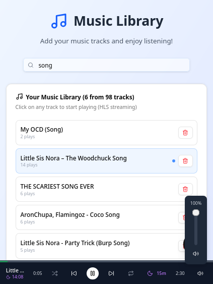
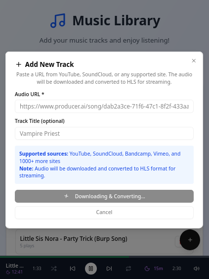

# 🎵 Music Library

A self-hosted music streaming app. Paste any YouTube, SoundCloud, or audio URL and build your personal library.

<p align="center">
  
   
</p>

## 🐳 Quick Start

```bash
docker-compose up -d
```

Open **http://localhost:8080**

---

## ✨ Features

| Feature | Description |
|---------|-------------|
| 🔗 URL Downloads | YouTube, SoundCloud, Bandcamp, and 1000+ sites |
| 📡 HLS Streaming | Efficient audio streaming |
| 🎵 Full Player | Play, pause, seek, volume, next/previous |
| 🔀 Shuffle & Repeat | All playback modes |
| 😴 Sleep Timer | Auto-stop with fade-out |
| ⌨️ Keyboard Shortcuts | Space, arrows, M, S, R, T |
| 🎛️ Media Keys | OS-level controls (next/prev/pause) |

---

## 🛠️ Development

### Docker (build locally)

```bash
docker-compose up -d --build
```

### Manual

```bash
# Frontend
cd client && bun install && bun dev

# Backend
cd server && cargo run --release
```

### Docker Management

```bash
docker-compose pull       # Update image
docker-compose logs -f    # View logs
docker-compose down       # Stop
```

See [Server Options](docs/API.md#server-options) for more details.

---

## ⌨️ Keyboard Shortcuts

| Key | Action |
|-----|--------|
| `Space` | Play / Pause |
| `←` `→` | Previous / Next |
| `M` | Mute |
| `S` | Shuffle |
| `R` | Repeat |
| `T` | Sleep Timer |

---

## 📁 Data

Your music is stored in the `./hls_cache/` directory, which will be created on your host for persistent storage.

---

## 📄 License

MIT
